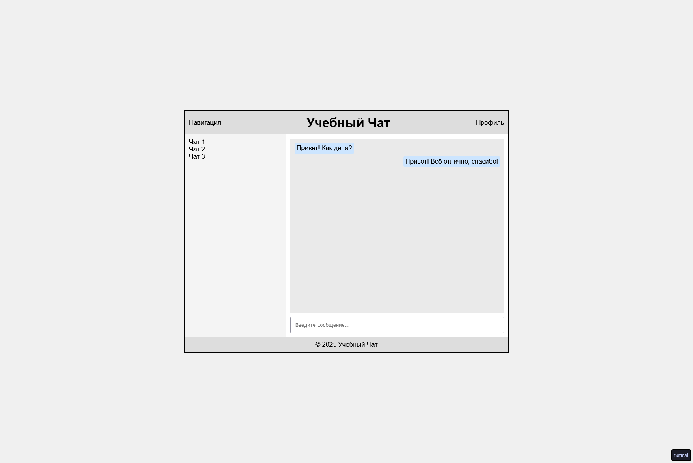

# Применение Grid+Flex для верстки страницы

## Цель:

Используя только CSS, оформить готовую HTML-страницу так, чтобы все элементы корректно располагались с помощью Grid и Flex.

_Все остальные стили кроме применения самих grid и flex - даны_

Условия:

- Вам дан файл index.html с готовой структурой страницы.
- Вам нужно дописать CSS-правила в styles.css, чтобы расположить элементы согласно макету, используя только Grid и Flex систему.

## Готовый макет

# Как сдавать

- Создайте форк репозитория в вашей организации с названием-этого-репозитория-вашафамилия
- Используя ветку wip сделайте задание
- Зафиксируйте изменения в вашем репозитории
- Когда документ будет готов - создайте пул реквест из ветки wip (вашей) на ветку main (тоже вашу) и укажите меня (ktkv419) как reviewer

Не мержите сами коммит, это сделаю я после проверки задания

